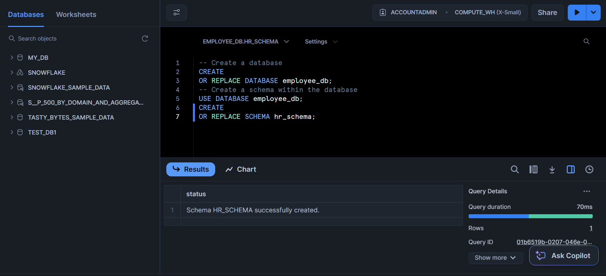
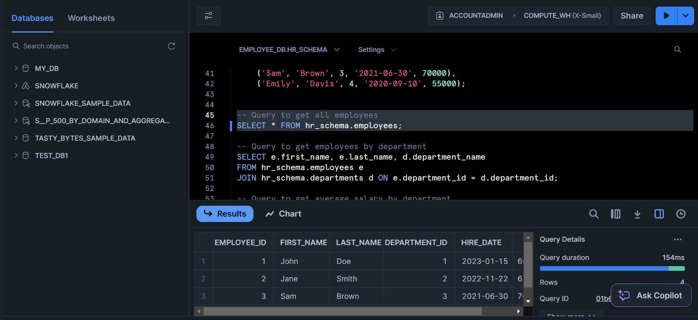
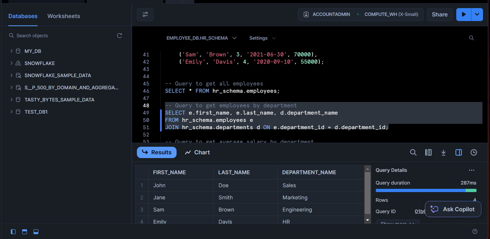
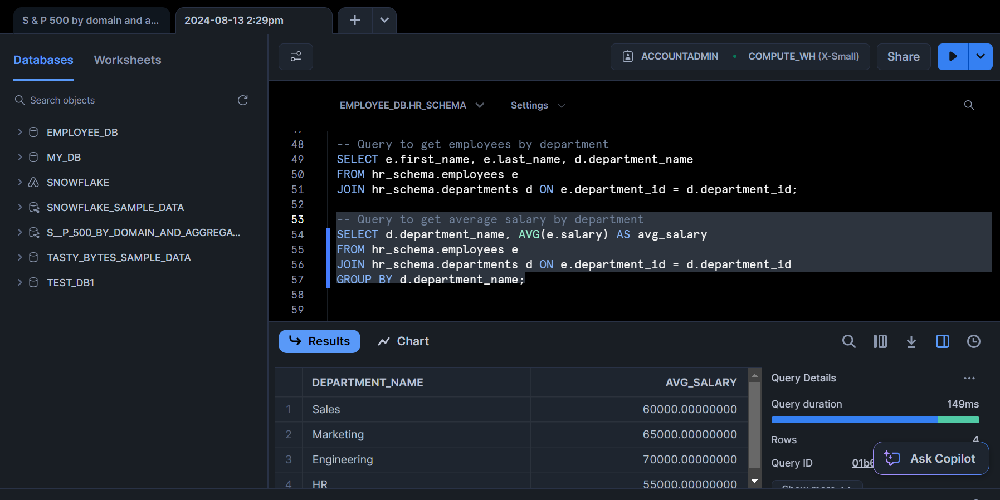
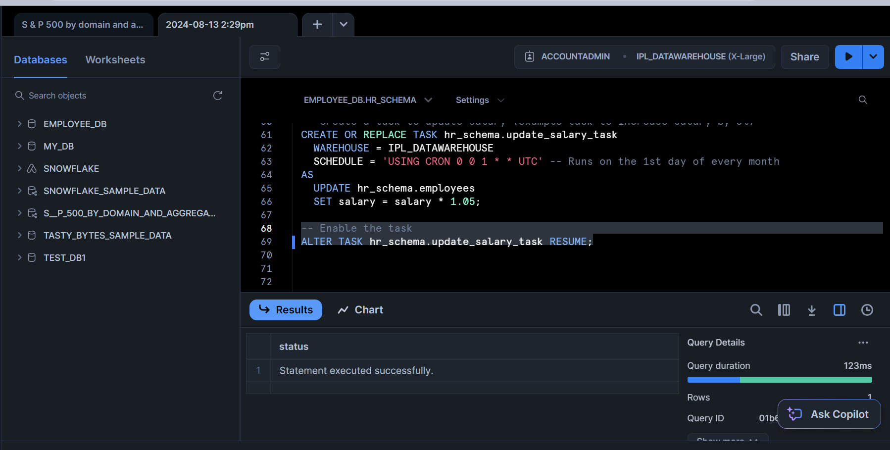

# Employee Management System

## Project Overview

The **Employee Management System** project is designed to demonstrate basic concepts of Snowflake data warehousing and SQL. The primary goal was to create a simple database to manage employee information and showcase fundamental operations such as creating tables, inserting data, querying data, and setting up scheduled tasks.

## Purpose of the Project

The main objectives of this project are:

1. **Familiarization with Snowflake**: To gain a basic understanding of how to work with Snowflake for data management without diving into advanced features.
2. **Demonstrate Core SQL Operations**: To show how to perform essential data operations like table creation, data insertion, querying, and task scheduling in Snowflake.
3. **Simplify Learning**: To provide a clear and manageable example of Snowflake's functionality, avoiding unnecessary complexity.

## Project Components

1. **Database and Schema Creation**: Establishing a database and schema to organize tables.
2. **Table Definitions**: Creating tables for storing employee and department data.
3. **Data Insertion**: Populating tables with sample data to simulate real-world scenarios.
4. **Query Execution**: Writing SQL queries to retrieve and analyze the data.
5. **Task Scheduling**: Setting up an automated task to update employee salaries periodically.

## How to Use This Project

1. **Database and Schema Creation**: Begin by creating the necessary database and schema.
2. **Table Creation**: Define the structure of the tables to hold your data.
3. **Data Insertion**: Add sample data to the tables to work with.
4. **Querying**: Execute SQL queries to interact with and analyze the data.
5. **Task Management**: Create and schedule tasks to automate processes.

## Screenshots

To complement the project, please include screenshots of the following:

1. **Database and Schema Creation**: Screenshots showing the commands used to create the database and schema.
2. **Table Definitions**: Screenshots of the table creation commands and their structures.
3. **Data Insertion**: Screenshots showing the inserted data in the tables.
4. **Query Execution**: Screenshots of the SQL queries and their results.
5. **Task Scheduling**: Screenshots of the task creation and scheduling process.

### Screenshot Placement
## Screenshots

To help visualize the project and provide a clearer understanding, here are the screenshots of the various stages:

1. **Database and Schema Creation**
   - 

2. **Query Execution**
   - 
   - 
   - 

3. **Task Creation**
   - 

4. **Task Scheduling**
   - 

## Conclusion

This project provides a practical introduction to Snowflake's capabilities, focusing on essential database operations. By following the steps outlined, users can gain hands-on experience with Snowflake in a manageable and straightforward manner.

